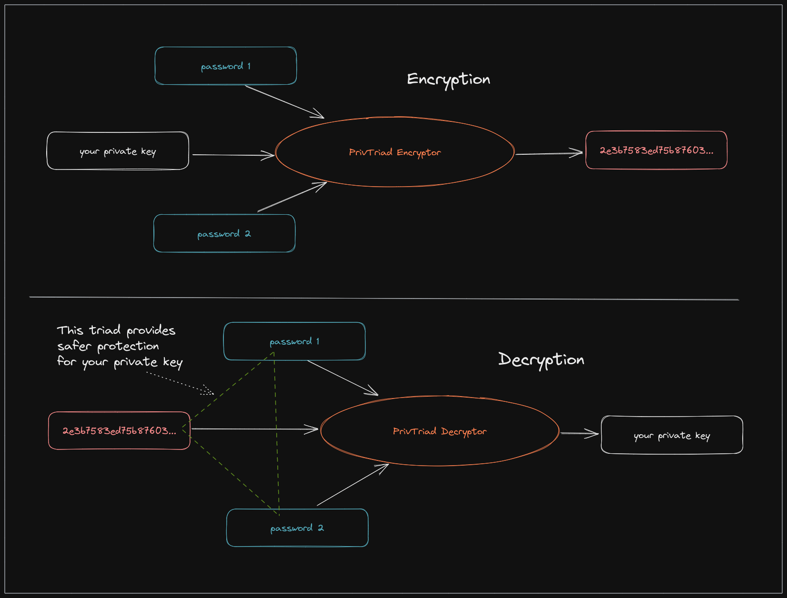
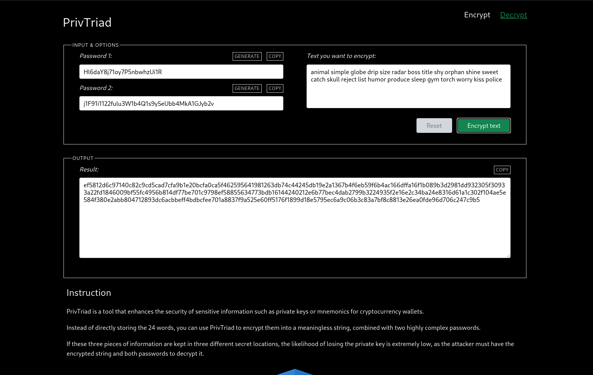

# [priv-triad](https://priv-triad.pages.dev)

[PrivTriad](https://priv-triad.pages.dev) enhances the security of sensitive text such as mnemonic phrases by converting into 3 pieces of meaningless info.



## Screenshot




## Setup

Please fork this repo, then:

```sh
git clone git@github.com:{YOUR_NAME}/priv-triad.git
cd priv-triad
cp example.env .env
npm i
npm run dev
```

Please change the default value of `VITE_CRYPTO_SALT` in .env and keep it safe for your own system.

This app was built with [Svelte](https://svelte.dev/), [chota.css](https://jenil.github.io/chota/) and [Vite](https://vitejs.dev/).

## Secret store strategy

We have 2 recommended methods to store 3 secret pieces of encrypted data.

- You can store each value in a different place. For example:
  - password 1 in Bitwarden
  - password 2 in a paper
  - encrypted string in an encrypted folder at [Filen](https://filen.io/r/e7758fe5b033ed143e73a3cbafa3ff2f). 
- The second way is to divide into 3 pairs of values, save them in 3 different places. For example:
  - Bitwarden: password 1 + password 2
  - Filen: password 1 + encrypted string
  - Paper: password 2 + encrypted string

With the first option, you need access in 3 different places to get enough decryption information.
With the 2nd option, you only need to access 2 places to have enough decryption information. This is also the method that Ledger has recently tried to apply.

---
